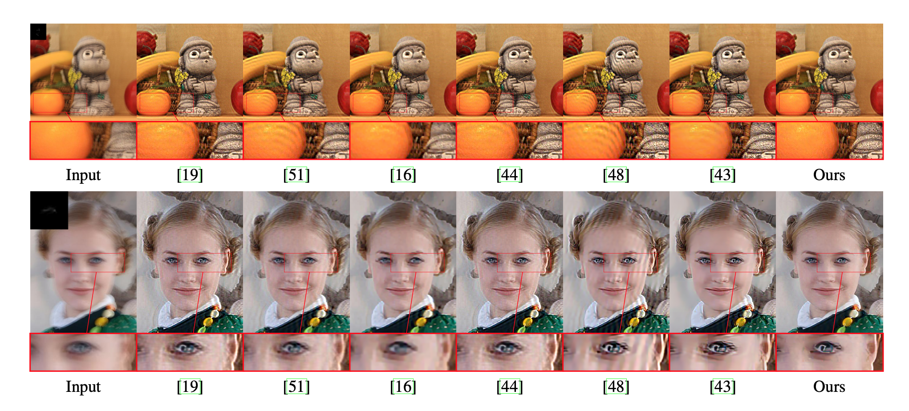

# Deep Learning for image deconvolution in the presence of kernel/model uncertainty


This repo provides pre-trained models and the results on benchmark datasets of our CVPR 2020 paper.
[main paper](), [supp](), [poster]()


## Usage
Download [pretrained models](https://drive.google.com/open?id=1vFhxxrqYKKfsPVgxgeY_EYbL_v4fNIsi) and [data](https://drive.google.com/open?id=1VY7hc6GXdAM4AyYWOuRU0EIZjqFuzjLI). Put them into separate folders. 

Run `test.py` for deblurred images.

You can also test your data, but you need to keep the same noise level as the same. 

## Results



## Results on benchmark datasets

You can also download the [deblurred results](https://drive.google.com/open?id=1goazpQkHMGUU4N_t9jBtdzvGdx1JNW59) and run `compute_metrics.py` to compute the PSNR/SSIM with the same settings as ours. 

Our results contain both synthetic blurry images with kernel error and real images.

For synthetic images, we provide the results with two settings: 
* noise level is 1% (2.55). Images are generated by "valid convolution" with edge tapper boundary extension.
* noise level is 0% (0.0). Images are generated by "same convolution" with periodic extension.

For real images, please see `Lai_Real` from [deblurred results.](https://drive.google.com/open?id=1goazpQkHMGUU4N_t9jBtdzvGdx1JNW59) 


## Key References

Krishnan, Dilip, and Rob Fergus. "[Fast image deconvolution using hyper-laplacian priors](https://dilipkay.wordpress.com/fast-deconvolution/)." *Advances in neural information processing systems*. 2009.

Zoran, Daniel, and Yair Weiss. "[From learning models of natural image patches to whole image restoration.](https://people.csail.mit.edu/danielzoran/EPLLICCVCameraReady.pdf)" *2011 International Conference on Computer Vision*. IEEE, 2011.

Kruse, Jakob, Carsten Rother, and Uwe Schmidt. " [Learning to push the limits of efficient FFT-based image deconvolution. ](http://research.uweschmidt.org/pubs/iccv17kruse.pdf)" *Proceedings of the IEEE International Conference on Computer Vision*. 2017.

Zhang, Kai, et al. "[Learning deep CNN denoiser prior for image restoration](http://openaccess.thecvf.com/content_cvpr_2017/papers/Zhang_Learning_Deep_CNN_CVPR_2017_paper.pdf)." *Proceedings of the IEEE conference on computer vision and pattern recognition*. 2017.

Zhang, Jiawei, et al. "[Learning fully convolutional networks for iterative non-blind deconvolution](https://arxiv.org/pdf/1611.06495.pdf)." *Proceedings of the IEEE Conference on Computer Vision and Pattern Recognition*. 2017.

Ji, Hui, and Kang Wang. "[Robust image deblurring with an inaccurate blur kernel.](http://www.math.nus.edu.sg/~matjh/download/robust_deblur/TIP_2012_deblur.pdf)" *IEEE Transactions on Image processing* 21.4 (2011): 1624-1634.

Whyte, Oliver, Josef Sivic, and Andrew Zisserman. "[Deblurring shaken and partially saturated images.](https://www.di.ens.fr/willow/research/saturation/whyte11.pdf)" *International journal of computer vision* 110.2 (2014): 185-201.

Vasu, Subeesh, Venkatesh Reddy Maligireddy, and A. N. Rajagopalan. "[Non-blind deblurring: Handling kernel uncertainty with CNNs](http://openaccess.thecvf.com/content_cvpr_2018/papers/Vasu_Non-Blind_Deblurring_Handling_CVPR_2018_paper.pdf)." *Proceedings of the IEEE Conference on Computer Vision and Pattern Recognition*. 2018.

### 


## Bibtex

```

```


